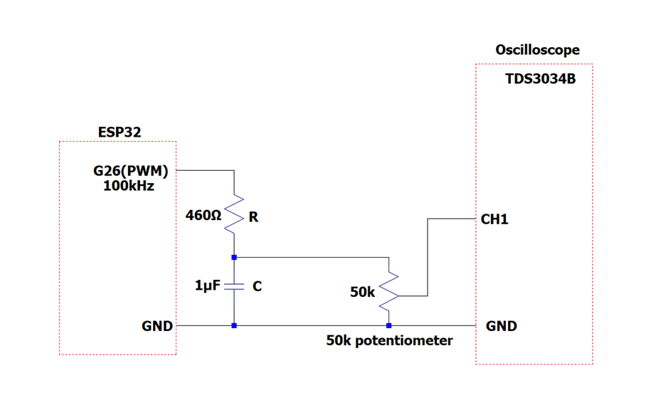
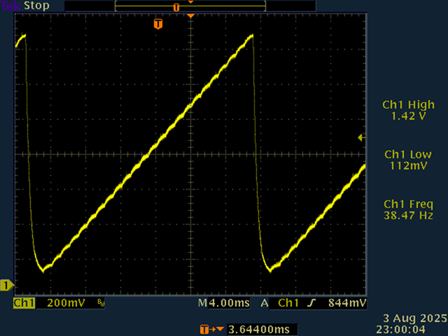
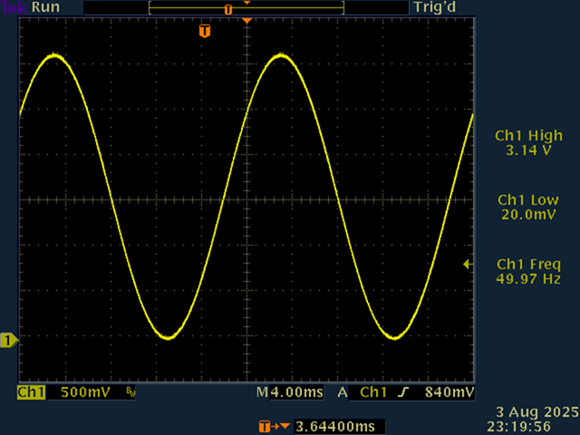
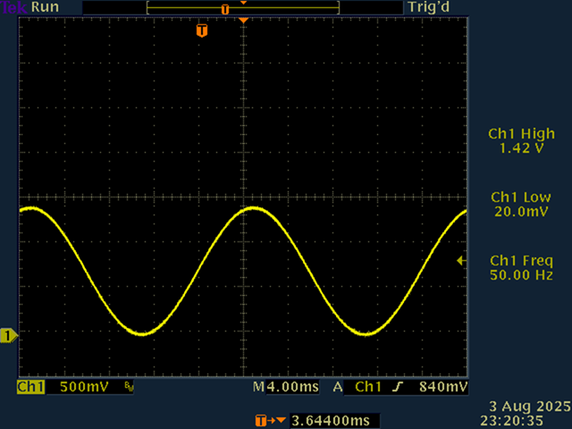
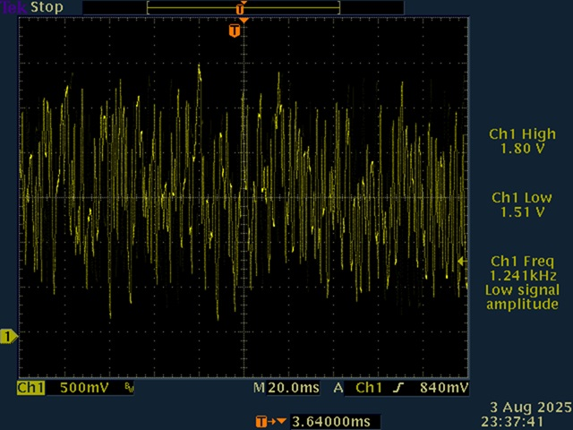
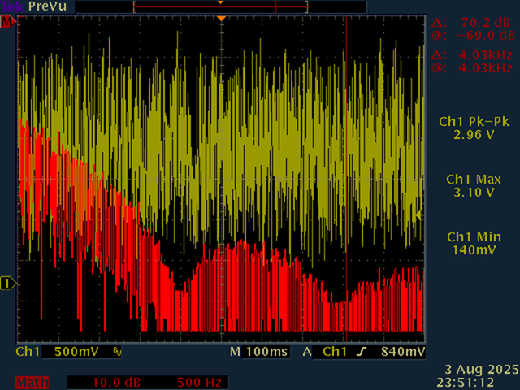
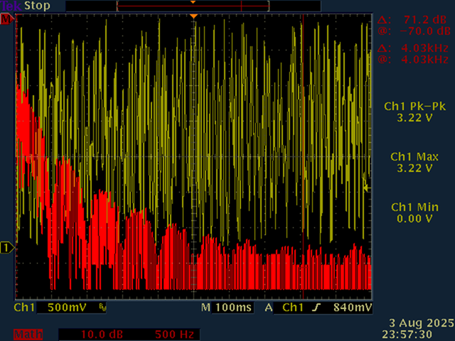
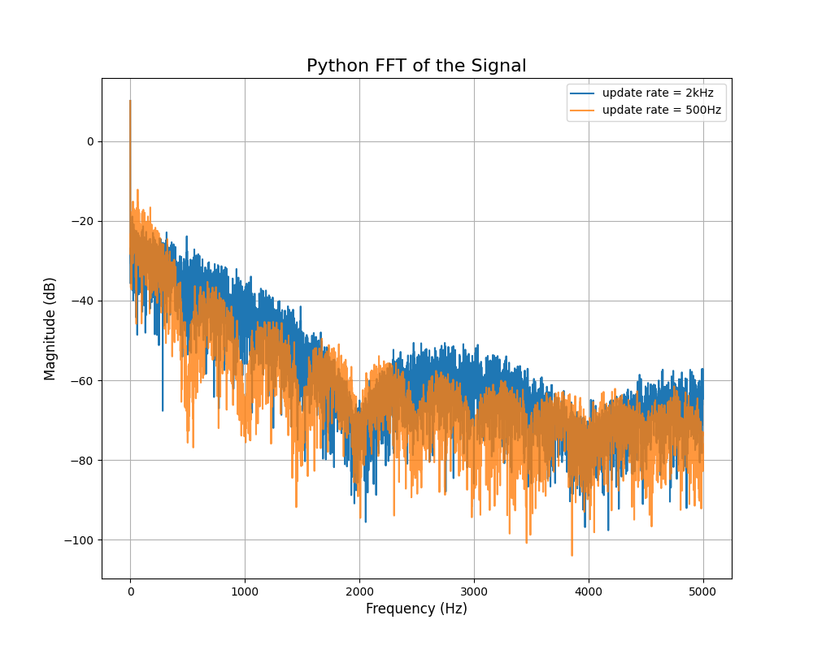
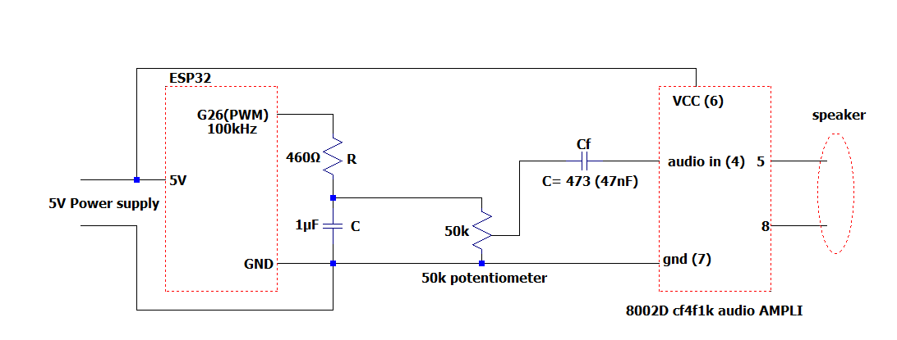
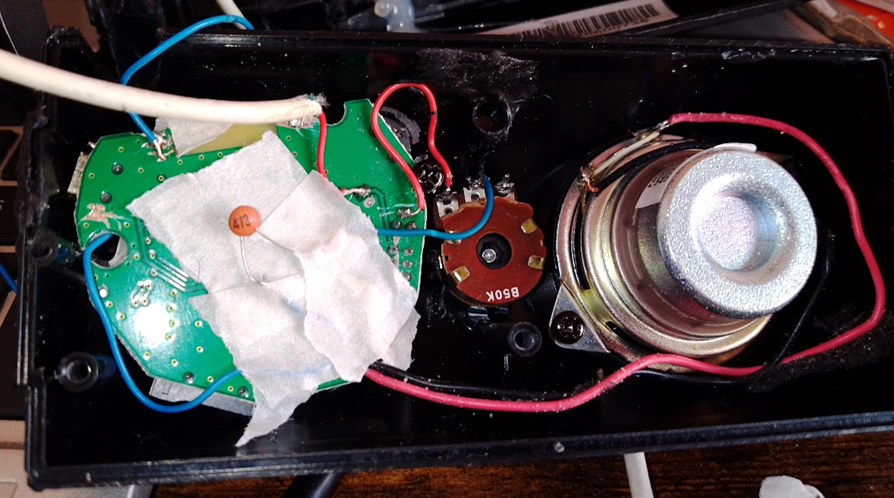

# Using ESP32 (or Arduino) PWM for a Function Generator and White-Noise Generator¶

# Table of contents¶

  * Setup
  * Test results
    * Simple wave generator
    * 50 Hz sine wave generator
    * White noise generator
  * Bonus: implement a simple white-noise generator for children.

In this project, we will build a `SW DAC` using 100 kHz PWM and an RC filter. This `SW DAC` will be used to generate simple waveforms and to create a white-noise sound generator.

## Setup ¶

Below the setup used to check the DAC idea

**Figure 1:** The test setup 

  

The RC smooths the PWM to acte like a mouving average, the potentiometer is only used to adjust the peak-to-peak level. FYI: The TDS oscillo has an input impedance of $1M\ohm$ and $13pF$.

$ \begin{aligned} R &= 460 \; \;\textrm{(ohm)} \\\\[10pt] C &= 1 \; \;\textrm{(µF)} \\\\[10pt] \mathrm{To} &= R \cdot C = 460 \cdot 1 &= 460 \; \;\textrm{(µs)} \\\\[10pt] F_{cutoff} &= \frac{ 1 \times 10 ^ {6} }{ \mathrm{To} \cdot 2 \cdot \pi } = \frac{ 1 \times 10 ^ {6} }{ 460 \cdot 2 \cdot 3.142 } &= 345.989 \; \;\textrm{(Hz)} \end{aligned} $ 

## Test results ¶

### Simple wave generator ¶

**C++ code of the ESP32**
    
    
    int pwmPin = 26; // GPIO26
    
    void setup() {
      ledcAttach(pwmPin, 100000, 8); // Attach GPIO26 to LEDC and configure it 100kHz
    }
    
    void loop() {
      for (int duty = 0; duty <= 255; duty = duty + 10) {
        ledcWrite(pwmPin, duty); // ledcWrite now takes the pin number
        delay(1);
      }
    }
    

**Oscilloscope screenshots**

**Figure 2:** Sawtooth waveform, Potentiometer = 100% 

  

The response rate is limited because of the RC circuit’s time constant.

### 50 Hz sine wave generator ¶

**C++ code of the ESP32**
    
    
    #include <cmath> // Include the cmath library for sin() and M_PI
    
    int pwmPin = 26; // GPIO26
    
    void setup() {
      ledcAttach(pwmPin, 100000, 8); // Attach GPIO26 to LEDC and configure it 100kHz
    }
    
    const int freq = 50; 
    const float Tper_us = 1000000.0 / freq; 
    
    void loop() {
      // Get the current time in microseconds within a single period
      unsigned long time_in_period = micros() % (unsigned long)Tper_us;
    
      // Convert the time to a normalized angle from 0 to 2*PI radians
      // The expression is (time_in_period / Tper_us) * (2 * M_PI)
      float angle = (float)time_in_period / Tper_us * 2.0 * M_PI;
    
      // Calculate the duty cycle from the sine wave
      // The value will range from 0 to 255 (for 8-bit resolution)
      int duty = (int)(127.5 * (sin(angle) + 1.0));
    
      ledcWrite(pwmPin, duty);
    }
    

**Oscilloscope screenshots**

**Figure 3:** Very clean sine wave, Potentiometer = 100% 

**Figure 4:** Potentiometer ≈ 50% 

  

Since 50 Hz is relatively slow, the output is very clean.

We can estimate the attenuation of the 100 kHz harmonic using the simplified formula:

$ \begin{aligned} \mathrm{Fsw} &= 100000.000 \; \;\textrm{(Hz)} \\\\[10pt] F_{cutoff} &= 345.989 \; \;\textrm{(Hz)} \\\\[10pt] F_{rate} &= \frac{ \mathrm{Fsw} }{ F_{cutoff} } = \frac{ 100000.000 }{ 345.989 } &= 289.027 \\\\[10pt] \mathrm{Nb}_{decades} &= \log_{10} \left( F_{rate} \right) = \log_{10} \left( 289.027 \right) &= 2.461 \end{aligned} $ 

Since we have first order low pass filter : Attenuation slop is –20 dB/decade

$ \begin{aligned} F_{SW_{Attenuation}} &= \left( - 20 \right) \cdot \mathrm{Nb}_{decades} \\\&= \left( - 20 \right) \cdot 2.461 \\\&= -49.219 \; \;\textrm{(dB)}\\\\[10pt] \\\\[10pt] F_{SW_{LinearAttenuation}} &= \left( 10 \right) ^{ \left( \frac{ F_{SW_{Attenuation}} }{ 20 } \right) } \\\&= \left( 10 \right) ^{ \left( \frac{ -49.219 }{ 20 } \right) } \\\&= 0.003 \\\\[10pt] \end{aligned} $ 

so 1 V of PWM is reduced to ~3mV after the RC filter

### White noise generator ¶

**C++ code of the ESP32**

A fast custom random function `fastRandom()` is implemented here to replace the standard `rand()`, which is too slow for high-frequency updates.
    
    
    int pwmPin = 26; // GPIO26
    
    
    /////////// RANDOM FAST FUNCTION 
    uint32_t seed = 123456789;
    uint8_t fastRandom() {
        seed = (1664525UL * seed + 1013904223UL);
        return (seed >> 24) & 0xFF;  // returns 0–255
    }
    /////////////////////////////
    
    
    int delay_us = 100; //10kHz of update 
    void setup() {
      ledcAttach(pwmPin, 100000, 8); // Attach GPIO26 to LEDC and configure it 100kHz
    }
    
    void loop() {
      int duty = fastRandom() % 256;
        ledcWrite(pwmPin, duty); // ledcWrite now takes the pin number
        delayMicroseconds(delay_us); 
    
    }
    

**Oscilloscope screenshots**

**Figure 5:** Noise form, 2kHz speed update 

**Figure 6:** Noise form, 2kHz speed update, oscilloscope FFT 

  

**Figure 7:** Noise form and oscilloscope FFT, 500Hz speed update 

**Figure 8:** Python FFT of 500Hz vs 2kHz 

  

The FFT of the pseudo white noise is not perfectly uniform, but it is very rich in frequency content.

## Bonus: implement a simple white-noise generator for children. ¶

In this section, I will show how to quickly build a white-noise sound generator using an ESP32 and a small Bluetooth audio amplifier. The PCB is modified to route the ESP32’s audio output to the amplifier in place of the original MCU output. Below is the simplified schematic of this device.

**Figure 9:** Proposed schematic 

  

The `8002D` is isolated on the PCB and powered directly with 5V as you can see in the schematic above.   
Below some images of the final result of the white noise generator

[You can download the 8002D CF4F1K audio amplifier datasheet here](https://datasheet4u.com/datasheet/ChipSourceTek/8002D-1541828)

**Figure 10:** Amplifier PCB 

.jpg)

**Figure 11:** Amplifier PCB with ESP32 

  

.jpg)

**Figure 12:** Final result 1 

.jpg)

**Figure 13:** Final result 2 

  

The results are satisfactory, and the potentiometer works well to adjust the sound level.

Below is a phone recording of the sound. The quality is not very accurate, but it’s enough to check the result.
