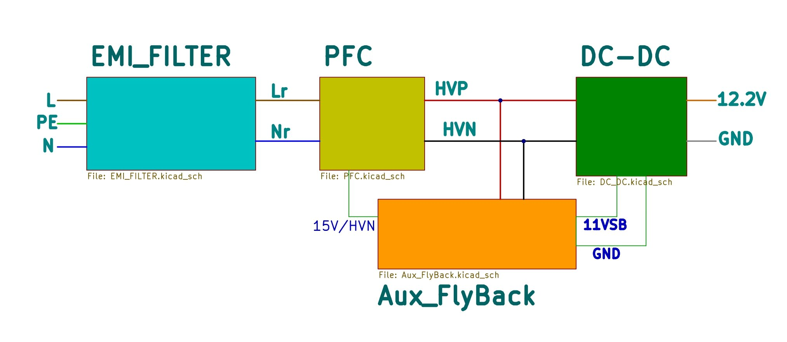
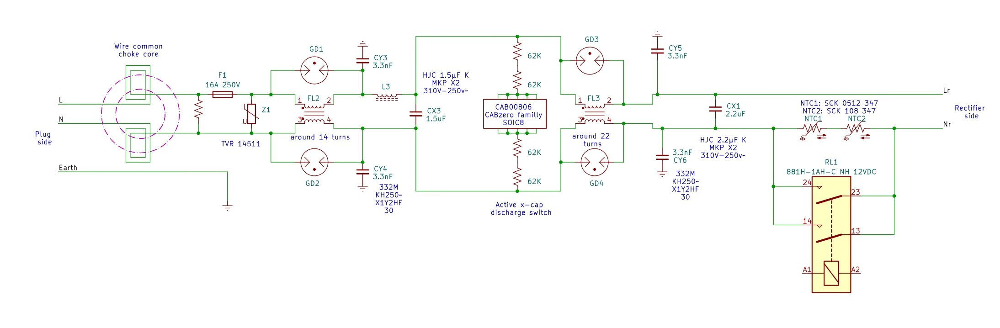
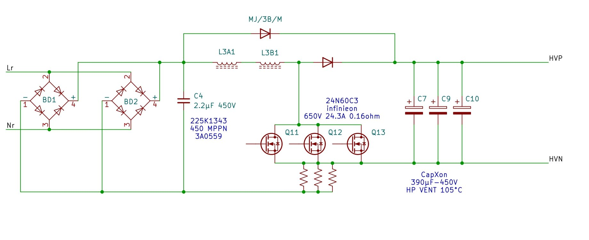
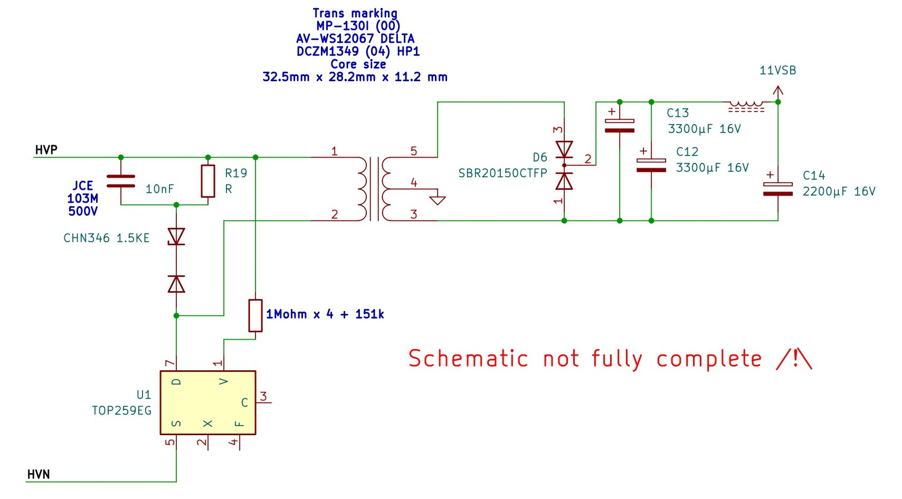
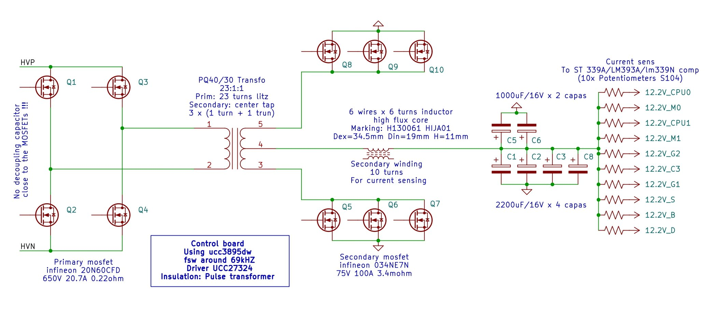

## Overview

**The signaletic plate**

## Power supply schematic

Below is the schematic of some principal parts of the power supply. The purpose is to illustrate the main components rather than provide a 100% accurate schematic.

**Block Diagram of the Schematic**

**The EMI Inptut filter**

The emi filter has a active discharge switch. The idea is to put a small circuit; when the grid voltage is applied, the switch is open. When the user removes the plug, the circuit detects the absence of the 50–60 Hz voltage variation and closes the circuit, so the X-capacitors can be discharged. The discharge resistors are optimized to work only when the plug is removed (small resistor size and simpler thermal management).

**The power factor correction (PFC)**

The PFC is a classical hard-switching PFC using 3 MOSFETs and 3 electrolytic capacitors.

**The Flyback Auxiliary Circuit**

The auxiliary power supply is built around the TOP259EG controller.

**The Main Isolated DC-DC**

The isolated 400V-12V DC-DC is a phase shifted full bridge (**PSFB**) converter.

* The main transformer is apparently a no gapped core PQ40/30.

* Primary mosfet is infinient mosfet 20N60CFD 650V 20.7A 220m$\Omega$ 

* Secondary mosfet is infinient mosfet 034NE7N 75V 100A 3.4m$\Omega$

* The output inductor is composed of 6 parallel wires, 6 turns, plus a small wire with 10 turns to sense the current.
